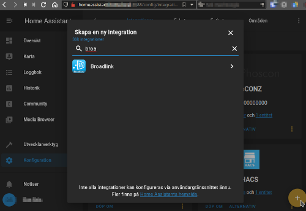

# Home Assistant Broadlink, Harmony Hub and more.
This is not a card, but clever use of existing ones. Since the release of new firmware for Broadlink it's now possible to have it connected to both cloud and local (f.ex. Home Assistant)

## Prepare Broadlink device for inclusion in Home Assistant
In the Broadlink app, select the Broadlink device. Tap the three dots (top right corner). and make sure that the device is not locked.


## Broadlink Manager to learn codes
Install the Broadlink Manager. I use the Docker version https://github.com/t0mer/broadlinkmanager-docker

```yaml
######################### Broadlink docker-compose #######################

 broadlinkmanager:
   image: techblog/broadlinkmanager
   container_name: broadlinkmanager
   network_mode: host
   environment:
     - PUID=1000
     - PGID=1000
     - TZ=Europe/Stockholm
   volumes:
     - /root/docker-compose/broadlink/broadlinkmanager:/opt/broadlinkmanager/data
   restart: unless-stopped
```

Browse to Broadlink Manager (port 7020) and click “Actions”, then “Learn IR Code”. Press the button on the remote and you should receive a base64 encoded string back. Copy that code for use in Home Assistant.


## Add Broadlink integration to Home Assistant
In Home Assistant go to Integrations and search for Broadlink, use the IP-address of the Broadlink device, visible in Broadlink Manager and app. Make a note of the entity id.



I use the following cards in Home Assistant:
* Button-card - https://github.com/custom-cards/button-card
* Horizontal-stack - https://www.home-assistant.io/lovelace/horizontal-stack/
With the button-card I send the IR signal direct with the “remote.send_command”:

```yaml
      - type: 'custom:button-card'
        icon: 'mdi:power-off'
        tap_action:
          action: call-service
          service: remote.send_command
          service_data:
            entity_id: remote.vardagsrumir_remote
            command: b64:JgDSAJ...SEgANBQAAAAA=
```

Together with “horizontal-stack” I get this card:


This is the raw yaml code for the card, it includes old config from my Harmony Hub and some settings with other integrations:
(HA_Card.yaml)
